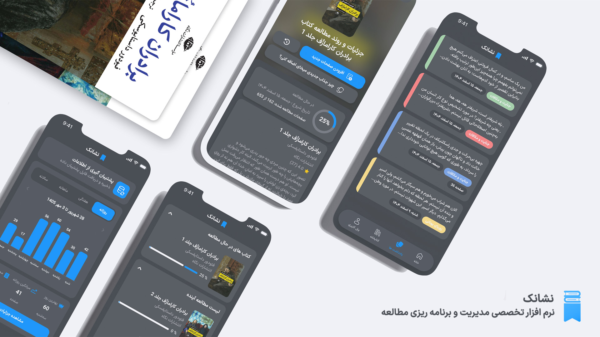
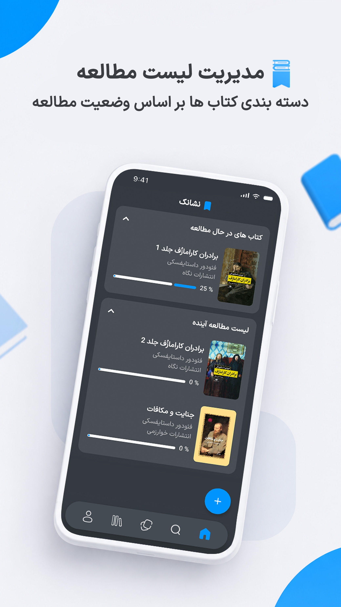
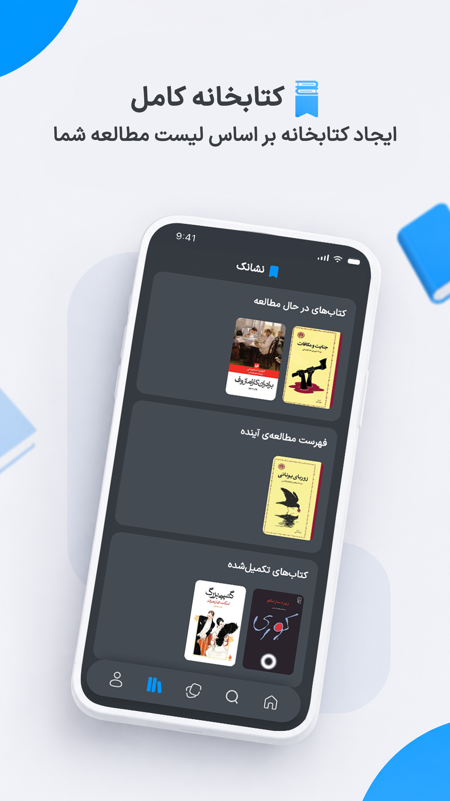
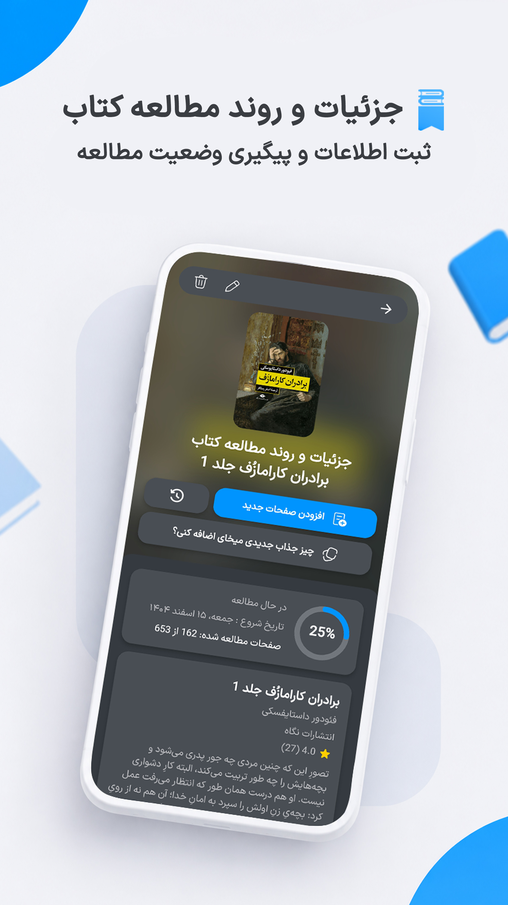
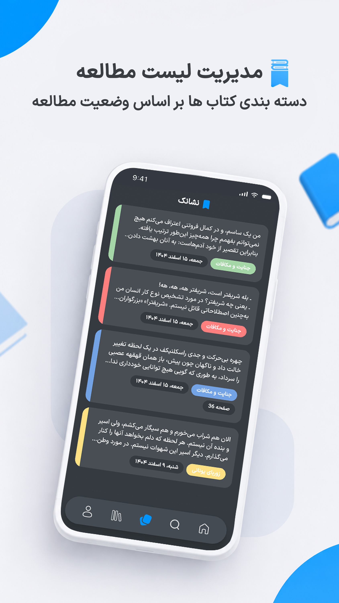
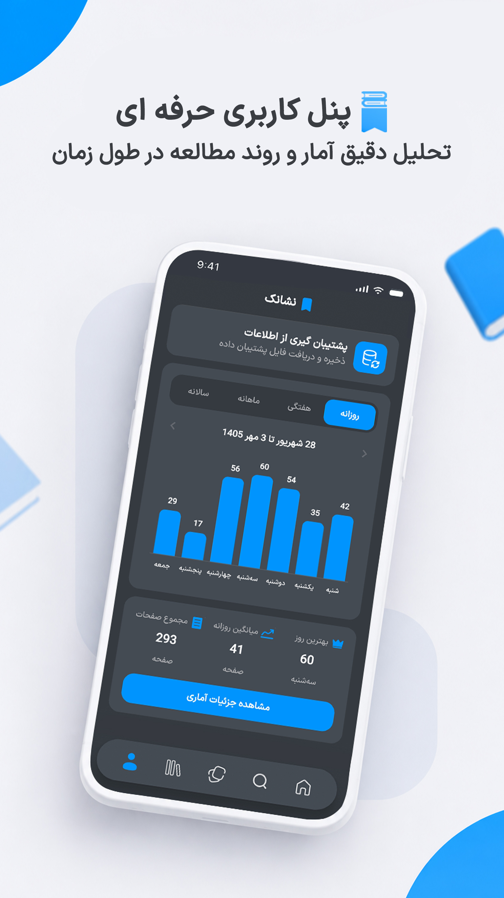
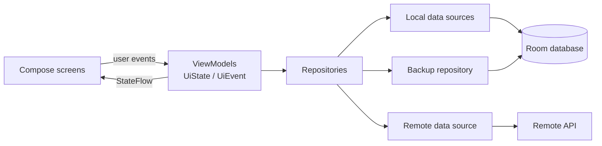

# Neshanak
### نشانک

**A Persian book tracker for Android — track your library, log reading sessions, collect quotes, and see your reading habits over time.**

Kotlin · Jetpack Compose · Room · MVVM

---

**Neshanak** (Persian for *bookmark*) is a book-tracking app built for Persian readers. Keep a personal library across four shelves, log every reading session, attach quotes and notes to your books, and review your statistics on the Jalali calendar. Books can be added manually with a cropped cover, or imported through the built-in book search with cover, author, and publisher pre-filled.

The entire UI is in Persian and laid out right-to-left.

## Screenshots

   
  <b>App overview</b>

<table>
  <tr>
    <td align="center"> <b>Home</b></td>
    <td align="center"> <b>Library</b></td>
    <td align="center"> <b>Book details</b></td>
  </tr>
  <tr>
    <td align="center"> <b>Notes &amp; quotes</b></td>
    <td align="center"> <b>Reading chart</b></td>
    <td></td>
  </tr>
</table>

## Features

- **Personal library** — organize books as *reading*, *to read*, *completed*, or *dropped*, with paper/ebook types and cover images.
- **Book search** — find a book online and import it with cover, author, and publisher pre-filled; manual entry is always available.
- **Reading sessions** — log date, pages, and duration per book; book progress (pages read, total reading time) updates automatically, including when sessions are edited or removed.
- **Quotes & notes** — four note types (quote, content, opinion, note) with page references, per-book notebooks, and a global notes screen.
- **Statistics** — totals, averages, best day/week, active days, completion rate, and monthly note counts, all computed on the Persian calendar.
- **Reading chart** — a personal bar chart with daily, weekly, monthly, and yearly views.
- **Backup & restore** — export the whole library to a JSON file, share it, and merge it back on another device; existing data is reconciled by last-modified timestamps rather than overwritten.
- **Persian-first UX** — full RTL layout, IranSansX typography, Jalali date pickers, and light/dark themes.

## Tech Stack

| Category | Technology |
|---|---|
| Language | Kotlin (Coroutines & Flow) |
| UI | Jetpack Compose, Material 3, Lottie animations, uCrop cover cropping |
| Architecture | MVVM + Repository, unidirectional data flow (UiState / UiEvent) |
| Dependency injection | Koin |
| Navigation | Navigation Compose |
| Local storage | Room (SQLite) |
| Networking | Retrofit, OkHttp, Gson |
| Image loading | Coil |
| Persian calendar | PrimeCalendar, Jalali date pickers |
| Build & tooling | Gradle Kotlin DSL, version catalogs, KSP, R8 minification |

## Architecture

Neshanak follows **MVVM with a repository layer**, organized as a single-module project with packages grouped by feature.

Each screen is self-contained: a Compose screen, a ViewModel, and an explicit UI contract — an immutable `UiState` plus one-shot `UiEvent`s. State flows down from ViewModels through `StateFlow`; user actions flow up as events. ViewModels get their dependencies from Koin and never touch the database or network directly — that is the repositories' job. Room's reactive queries push updates through `Flow`, so lists and statistics refresh themselves when data changes. Navigation runs on Navigation Compose with typed routes; the main screen hosts a nested NavHost for the five bottom-bar sections, and arguments reach ViewModels through `SavedStateHandle`.

## Data & Storage

- **Entities** — `books`, `reading_sessions`, and `notes`. Sessions belong to a book through a foreign key with cascade delete; notes reference a book but survive its deletion (the reference is cleared, the note keeps the book title). Both child tables are indexed on `bookId` for fast per-book queries.
- **Sync-ready fields** — every table carries `isDeleted`, `lastModified`, and a `syncStatus` field (`CREATED` / `UPDATED` / `DELETED` / `SYNCED`). All data is local today and deletion is physical; these fields are groundwork for a future sync layer, and `lastModified` is what the backup merge relies on.
- **Complex fields** — cover, rating, and reading progress are serialized into columns through Gson type converters.
- **Layered access** — DAOs expose reactive `Flow` queries and suspend writes, wrapped by local data sources and repositories. The v1 → v2 schema change was handled with a hand-written Room migration.
- **Derived data** — a dedicated statistics repository `combine`s the data streams and feeds them to pure calculator objects, keeping all computation out of the UI layer.

## Backup & Restore

Neshanak's backup is **local and manual** — no account, no cloud.

- **What's included** — every book, note, and reading session, serialized to a versioned JSON document (format version 1). The snapshot is read inside a single database transaction, so it is always consistent.
- **Export** — save the file anywhere via the system file picker (as `neshanak_backup.json`), or send it straight through the Android share sheet.
- **Import** — pick a JSON file from any app. The file is parsed and validated first (unsupported format versions are rejected), then merged inside one Room transaction: new records are inserted, and existing ones are replaced only when the backup copy is newer — last-modified-wins, per record, so importing never blindly overwrites what is already on the device.
- **Result feedback** — a summary dialog reports how many records were inserted or updated for each entity.

## Project Highlights

- **Paginated reading chart** — a bar chart over reading sessions with daily, weekly, monthly, and yearly buckets: seven bars per page, page count derived from the oldest recorded session, a consistent scale across pages, and an RTL-aware pager with Jalali labels.
- **Persian-calendar statistics engine** — averages, best day/week, active days, and completion rate computed as pure functions over combined Room flows; weeks start on Saturday and months follow the Jalali calendar.
- **Transaction-safe backup merge** — per-record, last-modified-wins reconciliation with insert/update counts, all inside a single Room transaction.
- **Self-correcting progress** — book progress (pages read, total reading time) is recalculated from session diffs when sessions are added, edited, or removed.
- **Sync-ready schema** — UUID primary keys plus `lastModified` and per-record `syncStatus` are already in place for a future synchronization layer.
- **Disciplined UI contracts** — every screen pairs an immutable `UiState` with one-shot `UiEvent`s, plus dedicated validators and mappers, so Composables stay stateless and business logic stays out of the UI.

## Download

**Latest release — v1.1.0**

| | |
|---|---|
| APK | [Download from GitHub Releases](https://github.com/amirtashakkori/Neshanak/releases/latest) |
| Requires | Android 7.0 (API 24) or higher |
| Size | ~3.5 MB (R8-minified) |

## License

This repository is presented as a portfolio project. The source code is not public. © 2026 Amirhossein Tashakkori. All rights reserved.
